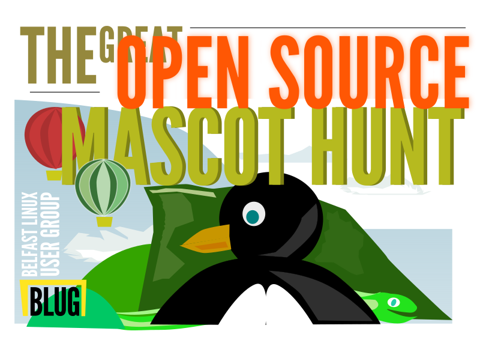

BLUG Zoo Trip
=============

In summer 2016, the Belfast Linux User Group (https://meetup.com/belfast-lug) ran a slightly unusual family
friendly event. We organized a trail for kids and adults to explore the zoo by matching open source projects
to mascot animals in the Zoo.

As this required a substantial amount of preparation of materials, but relatively little organization, the
most logical option was to open source all our work, so that it could be picked up and run elsewhere with
relatively little overhead. Tired of family barbequeues? Want something that engages kids with the LUG
concept? Then give this a crack. Even if you just end up with a load of pub regulars wandering around a
zoo, you're probably giving them some much needed exercise, and maybe helping fund the care of extremely
cute red pandas.

Pull requests are welcome for new animals or pages, and refactoring the list below to include more zoos
(such as ZSL, Chester, Dublin, Longleat, just saying...) in a readable fashion would be excellent. Anyone
really ambitious with writing can take on an aquarium or aviary (you may have to beat us to it though!)

Pages
-----

The pamphlet design, at present, is a cover sheet (stylized scene of animals in front of Cave Hill, Belfast),
followed by a cheesy instruction sheet (prefixed 00- and 01- respectively). It is all rather garish,
so feel free to tame the colour wildness for your own event.

The order of pages after that is arbitrary, until the final two (prefixed zy- and zz-, respectively). The
penultimate page combines Attribution, to collect all links and credits, and a final challenge related to
Apache Zookeeper. The back page is the list of animals. It is matched to the enclosure numbering in Belfast
Zoo so you probably want to change that for your local venue.

Requirements
------------

- Inkscape (https://www.inkscape.org/)
- League Spartan and League Gothic fonts (https://www.theleagueofmoveabletype.com/)
- Zoo / aquarium / aviary / herpetarium / very big petshop
- People who want to go to a LUG more often but weekday evenings don't work so well / kids who like open source

Usage
-----

All SVG is Inkscape SVG (https://www.inkscape.org/), and may use Inkscape extensions.
*This means a normal SVG reader may not render it correctly*. Export each desired page as SVG. Copy the
pages you want to use and customize for additional projects you would like to incorporate. You probably
want one pamphlet per person or small group.

Logos are not included in our git repo - all material here is original work and covered by the same
license. Pull requests will not be merged while containing material of incompatible copyright status.
For projects where logo reuse is encouraged, these are not hard to find and include yourself as a
compilation step.

End-users match the projects to the animals listed on the back page via the thinly veiled clues. They put
the animal's number from the back page into the box beside the project. This will have an additional
question they have to answer about the animal, to make it necessary to visit all the animals.

In BLUG's
case, we went around the enclosures and took a specific question from each enclosure info board - if you're
feeling lazy, just swap it for "What do I eat?", but you miss out on a pre-trip running around a zoo on your
own, which is pretty fun, frankly. Note that those boards seem to be designed to make writing zoo-trail
questions easy and are always visible, even if the animals are not, so are a helpful resource.

Tips
----

We recommend asking for permission from trademark and copyright holders especially where it is not explicit
or, at least, implied, or you are sure it is covered by fair use principles in your jurisdiction.
IANAL, so check out requirements yourself and respect express wishes of upstream projects.

Do check with the zoo whether all animal enclosures are accessible in your list. If you do do a run
around for questions to insert, prior to the event, this is a good time to check.

License
-------

To make merging of others' material more practical, this is licensed `CC0 <https://creativecommons.org/publicdomain/zero/1.0/legalcode>`_, although it would be
appreciated if you could include the Belfast Linux User Group in your attributions section, linking
this repository or https://meetup.com/belfast-lug

Zoo Animals
-----------

+--------------+---------------+-----------------------+----------------+-----------------+-----------------+
|Mascot        | Project       | Name (if known)       | In Belfast Zoo | In SuperTuxKart | GH Forks/Stars  |
|              |               |                       |                |                 | (if app.)       |
+==============+===============+=======================+================+=================+=================+
|Monkey        | Blender       | Suzanne               | Y              |  Y              | N/A             |
|              | (blender.org) |                       |                |                 |                 |
+--------------+---------------+-----------------------+----------------+-----------------+-----------------+
|              | Linux         | Tux                   | Y              |  Y              | 13k/33k         |
|Penguin       | (kernel.org)  |                       |                |                 | (not primary)   |
+--------------+---------------+-----------------------+----------------+-----------------+-----------------+
|Red panda     | Firefox       |                       | Y              |  N              | N/A             |
|              | (mozilla.org) |                       |                |                 |                 |
+--------------+---------------+-----------------------+----------------+-----------------+-----------------+
|Python        | Python        | Monty (unofficial)    | Y              |  N              | 588/1.8k        |
|              | (python.org)  |                       |                |                 | (not primary)   |
+--------------+---------------+-----------------------+----------------+-----------------+-----------------+
|Gecko         | Gecko         |                       | Y              |  N              | 827/679         |
|              | (mozilla.org) |                       |                |                 | (not primary)   |
+--------------+---------------+-----------------------+----------------+-----------------+-----------------+
|Elephant      | PHP           | Elephpant             | Y              |  Y              | 3.2k/9.3k       |
|              | (php.net)     |                       |                |                 | (not primary)   |
+--------------+---------------+-----------------------+----------------+-----------------+-----------------+
|(Lion)        | Open Source   |                       | Y              |  N              | -               |
|              | Lion Tracking |                       |                |                 |                 |
|              | Collars       |                       |                |                 |                 |
|              | (groundlab.cc)|                       |                |                 |                 |
|              | [seems dead]  |                       |                |                 |                 |
+--------------+---------------+-----------------------+----------------+-----------------+-----------------+
| Dove         | Dovecot       |                       | Y              | N               | 34/116          |
|              |               |                       |                |                 | (biggest)       |
+--------------+---------------+-----------------------+----------------+-----------------+-----------------+
| Lion         | LeoFS         |                       | Y              | N               | 81/524          |
|              |               |                       |                |                 |                 |
+--------------+---------------+-----------------------+----------------+-----------------+-----------------+
| Owl          | Web Ontology  |                       | Y              | N               | N/A             |
|              | Language      |                       |                |                 |                 |
+--------------+---------------+-----------------------+----------------+-----------------+-----------------+
| Sealion      | MariaDB       |                       | Y              | N               | 327/963         |
|              |               |                       |                |                 | (biggest)       |
+--------------+---------------+-----------------------+----------------+-----------------+-----------------+
| Giraffe      | Apache Giraph |                       | Y              | N               | 188/364         |
|              |               |                       |                |                 | (not primary)   |
+--------------+---------------+-----------------------+----------------+-----------------+-----------------+
| Pig          | Snort         | Pig                   | Y              | N               | 190/580         |
|              |               |                       |                |                 |                 |
+--------------+---------------+-----------------------+----------------+-----------------+-----------------+
| Dog          | GIMP          | Wilbur                | Y              | Y               | 190/580         |
|              |               |                       |                |                 |                 |
+--------------+---------------+-----------------------+----------------+-----------------+-----------------+
| Pigeon       | Pidgin        | Pidgin                | Y              | Y               | 190/580         |
|              |               |                       |                |                 |                 |
+--------------+---------------+-----------------------+----------------+-----------------+-----------------+
| Capybara     | Capybara      |                       | Y              | N               | 1062/7254       |
|              |               |                       |                |                 |                 |
+--------------+---------------+-----------------------+----------------+-----------------+-----------------+

Ubuntu releases
---------------

+--------------+---------------+
|Release       | In Belfast Zoo|
|              |               |
+==============+===============+
| Maverick     | Y             |
| Meerkat      |               |
+--------------+---------------+
| Warty        | Y             |
| Warthog      |               |
+--------------+---------------+

Animals to move up to table
---------------------------

Key

 - Y: in Belfast zoo according to Belfast Zoo website
 - y: in Belfast zoo according to Wikipedia, but not Zoo website
 - Yb: less likely to be familiar, or more tenuous mascot relationships
 - Yc: even more tenuous
 - M: unclear - possibly too distant species relation
 - []: no project using this animal

 - Y - Gentoo/ pengui tux
 - Y - postgres elephant
 - Y - hadoop elephant (but 3??)
 - Y - tortoise - tortoisesvn

 - Y - meerkat - Maverick Meerkat
 - Y - hog - Warty Warthog

 - Yb - egret labs stuff
 - Yb - wolf - wolfcms / wolfssl
 - Yb - lemur - lemur project
 - Yb - vtiger wiredtiger tiger intrusion detection
 - Yb - openswan
 - Yb - gravitylabs goose (but topgun...) gosling canada

 - Yc - ostrich sans
 - Yc - kangaroot

 - y - teal - flax&teal
 - y - Geeko opensuse

 - M - Mozilla dragon
 - M - Konqi - dragon(bearded dragon?)
 - M - Emule (miniature donkey)
 - M (coati) - Min ix racoon
 - M - bacula - bat (fruit bat)
 - N - Tux blue penguin
 - N - Blinky - fish - freedos
 - N - Chinchilla - big buck bunny
 - N - Gooey - octopu
 - N - Mouse xfce xue6
 - N - Amanda panda
 - N - Robot android
 - N - Bunny bbb
 - N - Gnu
 - N - Tarentula ???
 - N - Thunderbird
 - N - Adiumy
 - N - Henley platypus darwin
 - N - Beagle beagle
 - N - Pufferfish openbsd
 - N - bonobo
 - N - go gopher 
 
 - [Y] - goat - how can there be no popular projects with a goat logo????
 - [Y] - bear - or a bear???
 - [Y] - golden cat
 - [Y] - hyena - nope
 - [Y] - flamingo
 - [Y] - cheetah
 - [Y] - porcupine
 - [Y] - zebra
 
Ubuntu animals - +1 for same family, +2 for same species 
